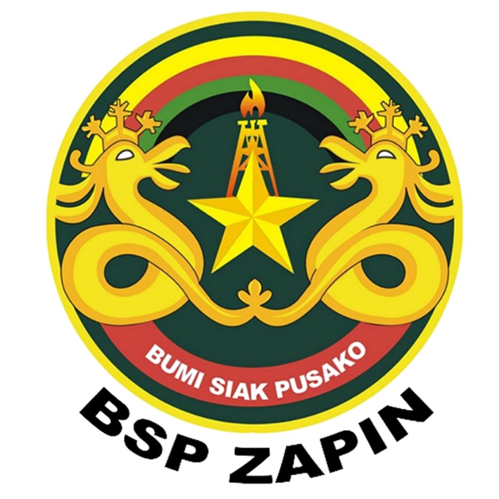

<div align="center">
  

  <h1>BSP Zapin</h1>
  <p><strong>Corporate Website and Internal Management System</strong></p>
  <p>Built with Laravel 12 &middot; Tailwind CSS 4 &middot; Vite</p>

  <br />

  
  
  
  
  
</div>

---

## Table of Contents

- [Overview](#overview)
- [Features](#features)
- [System Architecture](#system-architecture)
- [User Roles](#user-roles)
- [Technology Stack](#technology-stack)
- [Requirements](#requirements)
- [Installation](#installation)
- [Configuration](#configuration)
- [Running the Application](#running-the-application)
- [Module Documentation](#module-documentation)
- [Directory Structure](#directory-structure)
- [Database Schema](#database-schema)
- [Contributing](#contributing)
- [License](#license)

---

## Overview

BSP Zapin is a full-stack web application serving as both a public-facing corporate website and a comprehensive internal management platform. The system integrates content management, operational data tracking, compliance reporting, and investor relations into a single unified platform.

The application supports bilingual content (Indonesian and English), a role-based access control system with multiple user types, and a dedicated Whistleblower System (WBS) for anonymous compliance reporting.

---

## Features

### Public Website

The public-facing website is fully bilingual and accessible under locale-prefixed URLs (`/id/` and `/en/`).

**Homepage and Navigation**
The homepage displays dynamic hero sliders, company highlights, and partner logos managed entirely through the admin panel. Navigation menus are configurable from the admin interface, supporting nested menu structures.

**Company Profile**
The profile section presents the company's organizational information through CMS-managed pages with multilingual translation support.

**News and Media Publication**
A complete news portal with categorization, bilingual translations, featured images, and a content versioning system. News articles follow an editorial workflow before publication.

**TJSL (Tanggung Jawab Sosial dan Lingkungan)**
Dedicated section for Corporate Social Responsibility programs with image galleries, multilingual descriptions, and an editorial approval workflow.

**GCG (Good Corporate Governance)**
Document library organized by category. Visitors can browse and download governance documents directly from the website.

**Investor Relations**
Investor document repository with highlight items and structured document categories for shareholder communications.

**Operational Data Display**
A public page presenting summarized operational performance data for transparency.

**WBS Portal**
Public-facing Whistleblower System landing page where users can register, log in, and submit compliance reports.

**Legal Pages**
Privacy Policy and Terms of Service pages managed through the CMS.

**XML Sitemap**
Auto-generated sitemap at `/sitemap.xml` covering all pages and news articles for search engine indexing.

---

### Admin Panel

Accessible at `/admin`, this panel is reserved for users with the `admin` role.

**Dashboard**
A summary dashboard providing an overview of content and system activity.

**News Management**
Full CRUD management for news articles including multilingual content, image uploads, category assignment, and editorial status tracking. Admins can review content submitted by writers and published after reviewer approval.

**Page Management**
CMS for static pages with content versioning. Previous content versions can be restored at any time, and bundle snapshots allow rollback to grouped content states.

**Profile Pages**
Dedicated CMS management for the company profile section with bilingual translation support.

**Slider Management**
Upload and manage homepage hero sliders with bilingual titles and image control.

**Partner Management**
Add, edit, and categorize company partners displayed on the public website.

**Menu Management**
Configure navigation menus with hierarchical parent-child relationships.

**TJSL Management**
Oversight of all TJSL programs submitted through the writer workflow, including program images and translation management.

**GCG Category and Document Management**
Create and manage GCG document categories with multilingual labels. Upload governance documents and assign cover images and PDF files per category.

**GCG Highlight Items**
Manage featured highlight items displayed prominently on the GCG public page.

**Investor Relations Management**
Upload and organize investor documents with translations. Manage investor highlight items shown on the investor relations landing page.

---

### Operational Panel

Accessible at `/operational`, reserved for users with the `operational` role.

**Dashboard**
An analytics-heavy dashboard presenting operational data across three commodity streams: Flow Gas, Crude Oil, and Vitol. Each stream displays monthly summaries, category breakdowns, and interactive charts (daily, monthly, and yearly views).

**TV Display Mode**
A fullscreen display-optimized view (`/operational/tv`) designed to be shown on large monitors in operational control rooms. Displays live charts and a broadcast message ticker. The view auto-cycles through panels and presents up-to-date production summaries.

**Flow Gas Daily Records**
Input and manage daily flow gas readings per category. Supports MSCF, MMBTU, and Fix volume fields. Data is exported to monthly Excel reports.

**Crude Oil Daily Records**
Daily crude oil production entry with field-level tracking. The last 14 days of records are prominently displayed in chart and table formats.

**Vitol Records**
Monthly Vitol quantity tracking per year. Data is aggregated and presented in yearly summary charts.

**Broadcast Messages**
Manage scrolling ticker messages displayed on the TV view. Messages can be labeled, toggled active or inactive, and ordered by priority.

**Monthly Flow Gas Export**
Export complete monthly flow gas data to Excel format for reporting purposes.

---

### Writer Panel

Accessible at `/writer`, reserved for users with the `writer` role.

**Dashboard**
Overview of articles and programs assigned to or created by the writer.

**News Authoring**
Writers can create, draft, edit, and submit news articles for editorial review. The workflow enforces that articles pass through reviewer approval before reaching admin publication.

**TJSL Authoring**
Writers can create and manage TJSL program entries with image galleries and bilingual content.

---

### Reviewer Panel

Accessible at `/reviewer`, reserved for users with the `reviewer` role.

**Dashboard**
An overview of articles pending review.

**News Review**
Reviewers can approve or reject news articles submitted by writers. Rejections include feedback notes visible to the author.

**TJSL Review**
Reviewers oversee TJSL program submissions before they are finalized.

---

### Whistleblower System (WBS)

The WBS is a dedicated compliance reporting module with two separate user roles: Pelapor (reporter) and WBS Admin/Officer.

**Pelapor (Reporter) Portal**

Reporters register and authenticate independently of the main application. Once logged in, they can:

- Submit new compliance reports with the following violation categories: Corruption, Bribery, Gratification, Conflict of Interest, Theft, Fraud, Legal or Regulatory Violation.
- Attach supporting documents or files to reports.
- Track the status of submitted reports through the following lifecycle: Laporan Masuk, Ditelaah, Perlu Klarifikasi, Dalam Proses, Dalam Investigasi, Selesai, Ditutup, Di Luar Ruang Lingkup.
- Edit reports that are in the "Laporan Masuk" or "Perlu Klarifikasi" status.
- Receive notifications for status updates on their reports.

**WBS Admin / Officer Portal**

WBS administrators and officers manage the full lifecycle of compliance reports:

- View all submitted reports with filtering by status and keyword search.
- Update report status and leave admin notes throughout the investigation lifecycle.
- Generate PDF exports of individual reports.
- Access a notification center for new and updated reports.

**Email Notifications**

Automated email notifications are sent to the configured WBS admin email address upon new report submission.

---

### Authentication

**Standard Login**
Email and password authentication with rate limiting (5 attempts per minute). Inactive accounts are blocked from logging in.

**Google OAuth**
Single Sign-On via Google, powered by Laravel Socialite. Restricted to rate-limited redirect and callback routes.

**Single Device Session**
Each user account is enforced to one active session at a time. Logging in from a second device is blocked until the existing session expires or is detected as gone.

**Session Heartbeat**
A background heartbeat mechanism keeps track of active sessions and detects stale connections, enabling automatic session release.

**Inactivity Timeout**
Sessions are invalidated after a configurable period of inactivity, defaulting to 3 minutes.

---

## System Architecture

```
Public Website (/id, /en)
    Homepage, Profile, News, TJSL, GCG, Investor Relations,
    Operational Display, WBS Portal, Legal Pages

Admin Panel (/admin)
    Dashboard, News, Pages, Profile Pages, Sliders,
    Partners, Menus, TJSL, GCG, Investor Relations

Operational Panel (/operational)
    Dashboard, TV Display, Flow Gas, Crude, Vitol, Broadcast

Writer Panel (/writer)
    Dashboard, News, TJSL

Reviewer Panel (/reviewer)
    Dashboard, News, TJSL

WBS Panel (/wbs)
    Pelapor: Dashboard, Reports, Notifications
    Admin/Officer: Dashboard, Reports, Notifications
```

---

## User Roles

| Role | Panel Access | Description |
|---|---|---|
| `admin` | `/admin` | Full content and system management |
| `operational` | `/operational` | Data entry and operational monitoring |
| `writer` | `/writer` | Content authoring and submission |
| `reviewer` | `/reviewer` | Content review and approval |
| `pelapor` | `/wbs/pelapor` | WBS compliance report submission |
| `wbs_admin` | `/wbs/admin` | WBS report management and investigation |
| `wbs_officer` | `/wbs/admin` | WBS report management (co-access with wbs_admin) |

---

## Technology Stack

| Layer | Technology |
|---|---|
| Backend Framework | Laravel 12 (PHP 8.2+) |
| Frontend Build | Vite 7, Tailwind CSS 4 |
| Authentication | Laravel built-in auth + Laravel Socialite (Google) |
| PDF Generation | barryvdh/laravel-dompdf |
| Excel Export | maatwebsite/excel (PhpSpreadsheet) |
| Image Processing | intervention/image |
| PDF to Image | spatie/pdf-to-image |
| Database | MySQL 8.0 (or compatible) |
| Queue | Laravel Queue (database driver) |
| Email | Laravel Mail (configurable via SMTP) |

---

## Requirements

- PHP 8.2 or higher
- Composer 2.x
- Node.js 18+ and npm
- MySQL 8.0 or MariaDB 10.6+
- PHP extensions: `ext-gd`, `ext-mbstring`, `ext-pdo`, `ext-xml`, `ext-zip`

---

## Installation

### 1. Clone the Repository

```bash
git clone https://github.com/hidayaturromadhan/bsp-zapin.git
cd bsp-zapin
```

### 2. Automated Setup

A Composer setup script is provided that handles all installation steps:

```bash
composer run setup
```

This command performs the following steps in sequence:

1. Installs PHP dependencies via Composer
2. Copies `.env.example` to `.env` if not already present
3. Generates the application encryption key
4. Runs database migrations
5. Installs Node.js dependencies
6. Builds frontend assets for production

### 3. Manual Setup (Alternative)

If you prefer to run each step individually:

```bash
# Install PHP dependencies
composer install

# Copy environment file
cp .env.example .env

# Generate application key
php artisan key:generate

# Run database migrations
php artisan migrate

# Install Node.js dependencies
npm install

# Build frontend assets
npm run build
```

---

## Configuration

Open the `.env` file and configure the following sections:

**Database**

```env
DB_CONNECTION=mysql
DB_HOST=127.0.0.1
DB_PORT=3306
DB_DATABASE=bsp_zapin
DB_USERNAME=your_db_user
DB_PASSWORD=your_db_password
```

**Application URL**

```env
APP_URL=http://localhost:8000
APP_LOCALE=id
```

**Mail**

```env
MAIL_MAILER=smtp
MAIL_HOST=your.smtp.host
MAIL_PORT=587
MAIL_USERNAME=your@email.com
MAIL_PASSWORD=your_password
MAIL_ENCRYPTION=tls
MAIL_FROM_ADDRESS=noreply@yourdomain.com
MAIL_FROM_NAME="BSP Zapin"
```

**Google OAuth**

```env
GOOGLE_CLIENT_ID=your_google_client_id
GOOGLE_CLIENT_SECRET=your_google_client_secret
GOOGLE_REDIRECT_URI=http://localhost:8000/auth/google/callback
```

**Whistleblower System**

```env
WBS_ADMIN_EMAIL=wbs-admin@yourdomain.com
```

**Queue**

```env
QUEUE_CONNECTION=database
```

For production, it is recommended to use a persistent queue driver such as `redis` and to run queue workers as a managed process.

---

## Running the Application

### Development Mode

The following command starts all development services concurrently: the Laravel development server, queue listener, log viewer (Pail), and Vite development server.

```bash
composer run dev
```

Individual services can also be started separately:

```bash
# Laravel development server
php artisan serve

# Vite development server (for hot module replacement)
npm run dev

# Queue listener
php artisan queue:listen --tries=1 --timeout=0

# Log viewer
php artisan pail --timeout=0
```

### Production Build

```bash
npm run build
php artisan config:cache
php artisan route:cache
php artisan view:cache
```

### Running Tests

```bash
composer run test
```

---

## Module Documentation

### News Editorial Workflow

1. A `writer` creates a news article and saves it as `draft`.
2. The writer submits the article, setting the status to `in_review`.
3. A `reviewer` approves or rejects the article. Rejected articles return to `rejected` status with notes.
4. An `admin` performs final publication, moving approved articles to `published` status.
5. Published articles can later be moved to `archived`.

Audit logs are maintained for every status transition, recording the acting user and timestamp.

### Content Versioning

Static pages support content versioning. Each save creates a new version record. Administrators can:

- View the full version history of any page.
- Restore the page to any previous version.
- Restore a bundle snapshot (a grouped set of versions representing a specific content state).

### Operational TV Display

The TV display mode is designed for large screens in control rooms. It presents:

- Daily and monthly gas flow charts.
- Crude oil production trends for the last 14 days.
- Vitol monthly quantity summaries.
- A horizontally scrolling broadcast message ticker.
- A real-time clock.

The view is full-screen with no navigation and auto-refreshes at configurable intervals.

### WBS Report Lifecycle

```
Laporan Masuk
    -> Ditelaah
    -> Perlu Klarifikasi  (reporter may edit and resubmit)
    -> Dalam Proses
    -> Dalam Investigasi
    -> Selesai
    -> Ditutup
    -> Di Luar Ruang Lingkup
```

Reporters can edit their report only while it is in `Laporan Masuk` or `Perlu Klarifikasi` status. All other statuses lock the report for the reporter.

### Internationalization

All public-facing content uses locale-prefixed URLs. Supported locales are `id` (Indonesian) and `en` (English). Requests without a locale prefix are redirected to `/id` by default.

Content models that support translations include: News, Pages, GCG Categories, GCG Documents, Investor Documents, and TJSL Programs. Each translatable model has a corresponding `_translations` table with a `locale` column.

---

## Directory Structure

```
bsp-zapin/
|-- app/
|   |-- Helpers/              Global helper functions and menu helpers
|   |-- Http/
|   |   |-- Controllers/
|   |   |   |-- Admin/        Admin panel controllers
|   |   |   |-- Auth/         Authentication (login, register, Google OAuth)
|   |   |   |-- Operational/  Operational data controllers
|   |   |   |-- Reviewer/     Reviewer panel controllers
|   |   |   |-- Web/          Public website controllers
|   |   |   |-- Wbs/          Whistleblower system controllers
|   |   |   |-- Writer/       Writer panel controllers
|   |   |-- Middleware/       Role-based access, session management
|   |-- Mail/                 Mailable classes (WBS notifications)
|   |-- Models/               Eloquent models
|   |-- Services/             Service classes (WBS notification service)
|-- config/
|   |-- wbs.php               WBS-specific configuration
|-- database/
|   |-- migrations/           All database migrations
|   |-- seeders/              Database seeders
|-- public/
|   |-- images/               Publicly accessible static images
|-- resources/
|   |-- views/
|   |   |-- admin/            Admin panel Blade templates
|   |   |-- auth/             Authentication page templates
|   |   |-- operational/      Operational panel templates (dashboard, tv)
|   |   |-- reviewer/         Reviewer panel templates
|   |   |-- wbs/              WBS panel templates
|   |   |-- web/              Public website templates
|   |   |-- writer/           Writer panel templates
|-- routes/
|   |-- web.php               All application routes
|-- storage/
|   |-- app/                  File uploads
|   |-- logs/                 Application logs
```

---

## Database Schema

The application uses the following primary tables:

| Table | Description |
|---|---|
| `users` | User accounts with role and session tracking |
| `sliders` | Homepage hero sliders with bilingual titles |
| `news_categories` | News categorization |
| `news` | News articles with editorial workflow fields |
| `news_translations` | Bilingual news content (id, en) |
| `news_images` | Image attachments for news articles |
| `news_audit_logs` | Editorial workflow audit trail |
| `pages` | Static CMS pages |
| `page_translations` | Bilingual page content |
| `content_versions` | Page content version history |
| `menus` | Navigation menu entries with parent-child hierarchy |
| `partners` | Company partner records with category |
| `gcg_categories` | GCG document categories |
| `gcg_category_translations` | Bilingual GCG category labels |
| `gcg_documents` | Governance documents with PDF and cover |
| `gcg_document_translations` | Bilingual GCG document metadata |
| `gcg_highlight_items` | Featured GCG highlights |
| `investor_documents` | Investor relations documents |
| `investor_document_translations` | Bilingual investor document metadata |
| `investor_highlight_items` | Featured investor highlights |
| `tjsl_programs` | CSR program records |
| `tjsl_program_translations` | Bilingual TJSL program content |
| `tjsl_program_images` | Image galleries for TJSL programs |
| `flow_gas_categories` | Gas flow measurement categories |
| `flow_gas_daily_records` | Daily gas flow readings |
| `crude_daily_records` | Daily crude oil production data |
| `vitol_records` | Monthly Vitol quantity records |
| `broadcast_messages` | TV display ticker messages |
| `wbs_reports` | Whistleblower compliance reports |
| `wbs_report_attachments` | Supporting files for WBS reports |
| `wbs_notifications` | WBS internal notification records |

---

## Contributing

Contributions are welcome. Please follow these steps:

1. Fork the repository.
2. Create a feature branch (`git checkout -b feature/your-feature-name`).
3. Make your changes and ensure tests pass (`composer run test`).
4. Apply code style formatting (`./vendor/bin/pint`).
5. Commit your changes with a clear message.
6. Push to your fork and open a Pull Request.

---

## License

This project is open-source software licensed under the [MIT License](https://opensource.org/licenses/MIT).
